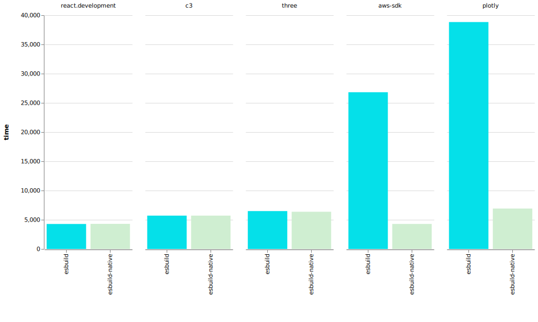

# esbuild-native

Node.js native wrapper for esbuild using [N-API](https://nodejs.org/api/n-api.html) and [Cgo](https://golang.org/cmd/cgo/).

## Building

Requirements:

- Go 1.13+.
- Node.js 8.16+, 10.16+, 11.8+, or 12+.
- 64-bit [GNU](https://jmeubank.github.io/tdm-gcc/) *and* [MSVC](https://github.com/nodejs/node-gyp#on-windows) compiler on Windows.

Install the dependencies in this folder using `npm i`, and then run `npm run init` and `npm run build`.

To test it out, open `node` and `require('.')`. You'll need to call `startService()` before using `minify(source)`, and then `stopService()` after you're done.

## Benchmarking

Run `node bench/run.js`.

